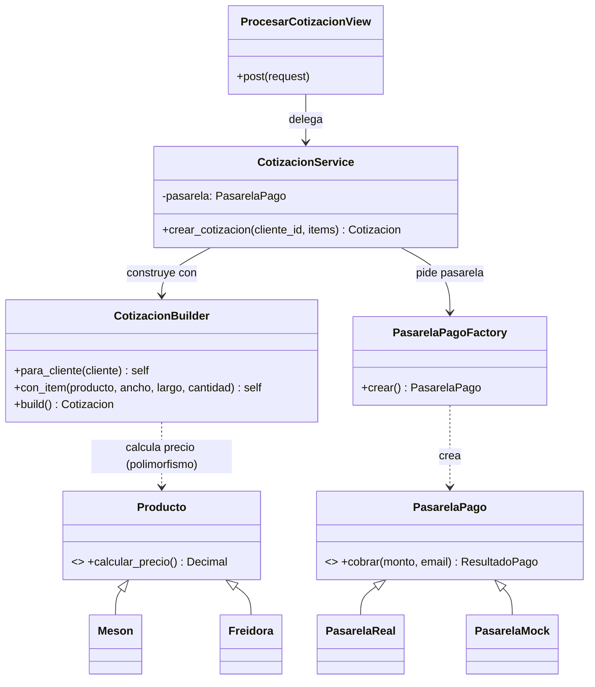

# Implementación del Patrón Creacional

## Módulo: Crear Cotización de acero a la medida

### Problema

Crear una cotización implicaba, en una sola vista (ver `ventas/_monolito_antes.py`):

- Validar el ancho mínimo (≥ 60 cm) solo para productos a la medida.
- Calcular el precio, que **depende del tipo de producto** (lámina, mesón, campana, freidora), con `if tipo == ...` regados.
- Verificar stock, crear la cotización con sus ítems y descontar inventario.
- Cobrar el anticipo del 50 % decidiendo con un `if os.getenv(...)` si usar la pasarela real o simulada.
- Generar la orden de fabricación y registrar el pago.

Todo mezclado en la vista, con múltiples `if/else`, acceso directo al ORM y el polimorfismo de productos perdido (había que preguntar el tipo a mano).

### Solución Arquitectónica

Se separó el flujo en capas (Arquitectura Limpia + SOLID), alineado al diagrama de dominio de la Actividad 1:

- **Capa de Interfaz — `ventas/views.py`:** `ProcesarCotizacionView` (CBV) con un `post()` de menos de 15 líneas: captura el request y delega. `CotizacionFormView` expone la misma lógica en una página HTML para probar a mano.
- **Capa de Aplicación — `ventas/services.py`:** `CotizacionService` orquesta el algoritmo: construir → enviar → cobrar anticipo → aprobar y generar orden. Recibe la pasarela por constructor (Inyección de Dependencias) y usa `@transaction.atomic`.
- **Capa de Dominio — `ventas/domain/` y `ventas/models.py`:** `CotizacionBuilder` construye y valida antes de persistir. Los modelos aplican **herencia y polimorfismo**: `Producto` es la base y `Lamina`, `Meson`, `Campana` y `Freidora` heredan y sobreescriben `calcular_precio()`. La interfaz `ProductoAMedida` la implementan solo los productos que se cortan a la medida (la `Freidora` no).
- **Capa de Infraestructura — `ventas/infra/`:** `PasarelaPagoFactory` decide, según `ENV_TYPE`, si instanciar `PasarelaReal` o `PasarelaMock`.

### Diagrama de Interacción



### Fragmento Clave

```python
# services.py
cotizacion = (CotizacionBuilder()
    .para_cliente(cliente)
    .con_item(producto, ancho_cm=80, largo_cm=200, cantidad=1)
    .build())                              # valida ANTES de guardar

anticipo = cotizacion.anticipo_50()
resultado = self.pasarela.cobrar(anticipo, cliente.email)   # pasarela de la Factory
```

### Justificación de las Decisiones de Diseño

1. **SRP:** vista = HTTP, servicio = orquestación, builder = construcción válida, pasarelas = cobro. Cada archivo cambia por una sola razón.
2. **OCP:** agregar un nuevo tipo de producto (p. ej. `Lavaplatos`) solo requiere una subclase con su `calcular_precio()`; el Builder y el Service no se tocan. Igual con una `PasarelaWompi` nueva en la Factory.
3. **LSP (Sustitución de Liskov):** donde se espera un `Producto` o una `PasarelaPago`, funciona cualquier subclase.
4. **DIP:** el servicio depende de las abstracciones (`PasarelaPago`), no de implementaciones. La pasarela entra por el constructor (DI), lo que permite inyectar mocks en las pruebas.
5. **Fail-fast + Atomicidad:** el Builder valida antes de tocar la BD y `@transaction.atomic` revierte todo si el anticipo se rechaza.

### Evidencia de Funcionamiento

- `python manage.py test ventas` → 6 pruebas OK (incluye inyección de dependencias, polimorfismo y carga de la página).
- `python demo.py` → muestra los cuatro tipos de producto cotizando con precios distintos, el flujo cotización → anticipo → orden, y el avance de la orden por sus etapas.
